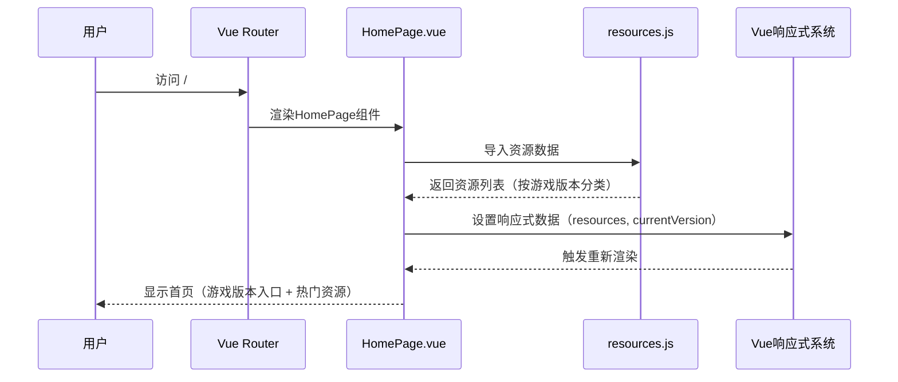
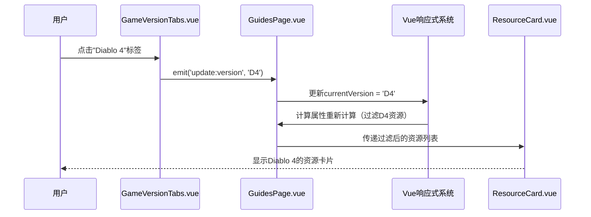
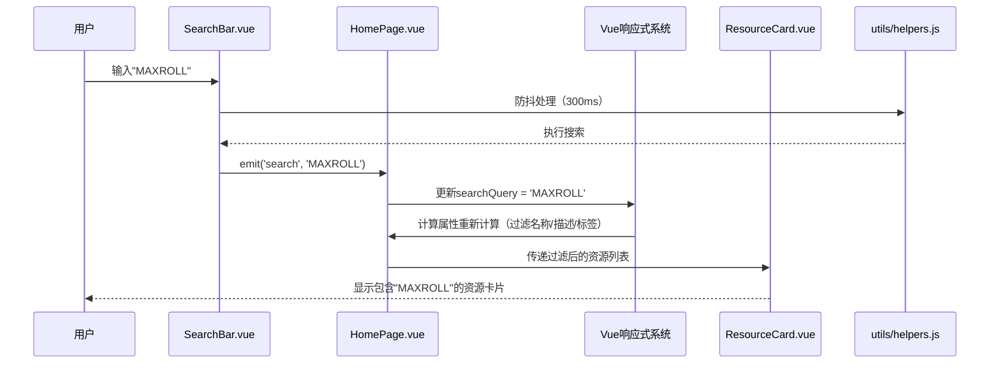
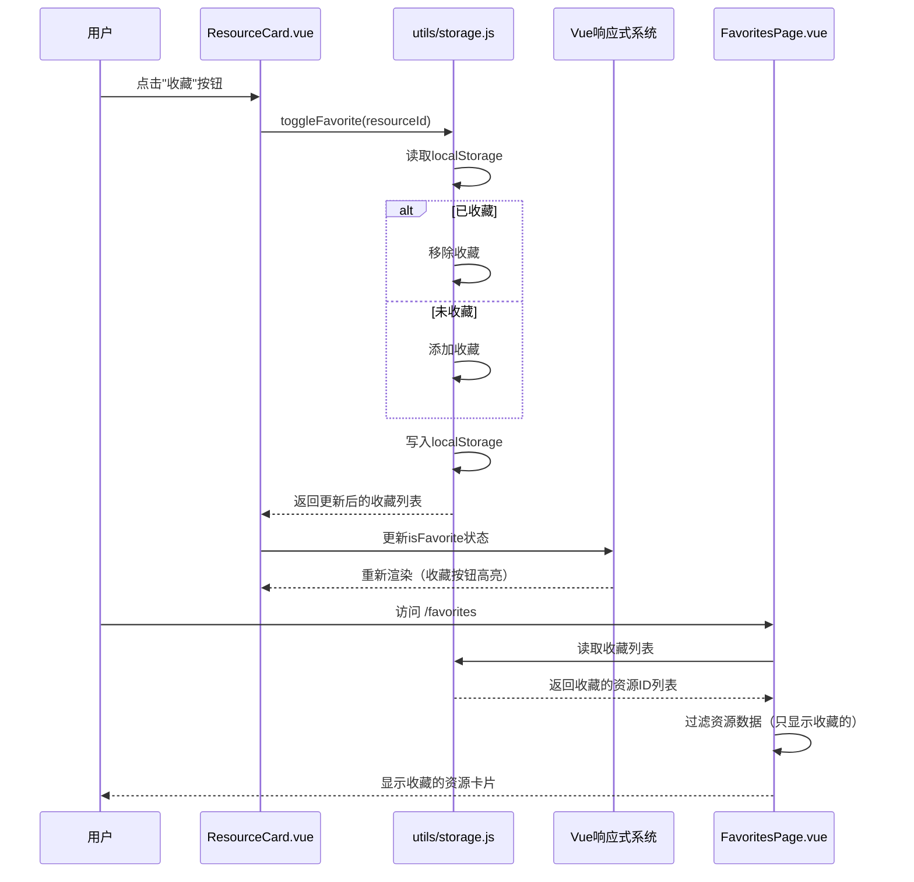

# 暗黑破坏神玩家导航站 - 系统架构设计

## 文档信息

| 项目 | 内容 |
|------|------|
| 项目名称 | 暗黑破坏神玩家导航站 |
| 文档版本 | v1.0 |
| 创建日期 | 2026-05-07 |
| 架构师 | 高见远(Gao) |
| 项目类型 | 纯静态导航站（Vite + Vue 3 + Tailwind CSS） |

---

## 一、实现方案 + 框架选型

### 1.1 技术栈确认

| 技术 | 选型 | 理由 |
|------|------|------|
| 构建工具 | Vite 5.x | 快速冷启动、热更新、现代构建工具 |
| 前端框架 | Vue 3.x (Composition API) | 轻量、组件化、生态丰富 |
| 样式方案 | Tailwind CSS 3.x + Element Plus | Tailwind utility-first + Element Plus组件库 |
| 路由管理 | Vue Router 4.x | Vue 3官方路由，支持SPA |
| 数据存储 | 静态JS/JSON文件 | 纯静态站点，无需后端 |
| PWA支持 | Vite Plugin PWA | 离线访问、添加到桌面 |
| 部署方案 | Vercel / GitHub Pages | 免费、自动化部署 |

### 1.2 项目初始化方案

**初始化命令**：
```bash
# 创建Vite + Vue 3项目
npm create vite@latest anhei-games -- --template vue

# 进入项目目录
cd anhei-games

# 安装依赖
npm install

# 安装Tailwind CSS
npm install -D tailwindcss postcss autoprefixer
npx tailwindcss init -p

# 安装Element Plus
npm install element-plus @element-plus/icons-vue

# 安装Vue Router
npm install vue-router@4

# 安装PWA插件
npm install -D vite-plugin-pwa
```

### 1.3 PWA配置方案

**使用 `vite-plugin-pwa`**：
- 生成 `manifest.json`
- 注册 `service worker`
- 缓存策略：
  - HTML/CSS/JS：Stale-While-Revalidate
  - 图片：Cache First
  - API请求：Network First（未来有后端时使用）

---

## 二、文件列表及相对路径

### 2.1 完整项目结构

```
anhei-games/
├── index.html                          # 入口HTML
├── package.json                       # 项目配置和依赖
├── vite.config.js                     # Vite配置（Vue + PWA + Tailwind）
├── tailwind.config.js                 # Tailwind CSS配置（暗黑主题）
├── postcss.config.js                  # PostCSS配置
├── public/
│   ├── favicon.ico                   # 网站图标（暗黑风格）
│   ├── manifest.json                 # PWA配置（名称、图标、颜色）
│   └── icons/                        # PWA图标（多种尺寸）
│       ├── icon-192x192.png
│       └── icon-512x512.png
├── src/
│   ├── main.js                       # 应用入口（创建Vue实例、注册插件）
│   ├── App.vue                       # 根组件（Header + RouterView + Footer）
│   ├── assets/
│   │   ├── styles/
│   │   │   ├── main.css            # 全局样式（Tailwind指令 + 暗黑主题）
│   │   │   └── diablo-theme.css   # 暗黑原版UI风格（自定义样式）
│   │   └── images/
│   │       ├── logo.png             # 网站Logo（暗黑风格）
│   │       └── bg-texture.png      # 背景纹理（可选）
│   ├── components/                   # 可复用组件
│   │   ├── AppHeader.vue           # 顶部导航栏（Logo + 游戏版本切换）
│   │   ├── AppFooter.vue           # 底部信息栏（关于 + GitHub链接）
│   │   ├── GameVersionTabs.vue     # 游戏版本切换Tabs（D2/D3/D4）
│   │   ├── ResourceCard.vue        # 资源卡片（攻略/工具/新闻）
│   │   ├── SearchBar.vue           # 搜索栏（防抖 + 实时过滤）
│   │   └── SeasonCountdown.vue    # 赛季倒计时（P1功能）
│   ├── pages/                       # 页面组件
│   │   ├── HomePage.vue           # 首页（游戏版本入口 + 热门资源）
│   │   ├── GuidesPage.vue         # 攻略社区页（按游戏版本分类）
│   │   ├── ToolsPage.vue          # 工具集合页（按游戏版本分类）
│   │   ├── NewsPage.vue           # 新闻资讯页（官方公告 + 更新日志）
│   │   └── FavoritesPage.vue      # 收藏页面（P1功能）
│   ├── router/
│   │   └── index.js               # 路由配置（Home/Guides/Tools/News/Favorites）
│   ├── data/                       # 静态数据文件
│   │   ├── resources.js            # 资源数据（攻略/工具，按D2/D3/D4分类）
│   │   └── news.js                # 新闻数据（官方公告 + 社区动态）
│   └── utils/
│       ├── helpers.js              # 工具函数（防抖、格式化日期等）
│       └── storage.js              # 本地存储封装（localStorage，用于收藏功能）
├── docs/
│   ├── PRD.md                      # 产品需求文档
│   └── ARCHITECTURE.md            # 本文档
└── README.md                       # 项目说明文档
```

### 2.2 核心文件说明

| 文件 | 用途 | 优先级 |
|------|------|--------|
| `vite.config.js` | Vite配置（Vue插件 + PWA插件） | P0 |
| `src/main.js` | Vue应用入口 | P0 |
| `src/App.vue` | 根组件 | P0 |
| `src/data/resources.js` | 资源数据（核心） | P0 |
| `src/pages/HomePage.vue` | 首页 | P0 |
| `src/components/ResourceCard.vue` | 资源卡片 | P0 |
| `src/router/index.js` | 路由配置 | P0 |
| `src/utils/helpers.js` | 工具函数 | P0 |
| `src/components/SearchBar.vue` | 搜索功能 | P0 |
| `src/pages/GuidesPage.vue` | 攻略社区页 | P0 |
| `src/data/news.js` | 新闻数据 | P0 |
| `src/pages/NewsPage.vue` | 新闻资讯页 | P0 |
| `src/components/SeasonCountdown.vue` | 赛季倒计时 | P1 |
| `src/pages/FavoritesPage.vue` | 收藏页面 | P1 |

---

## 三、数据结构和接口

### 3.1 TypeScript接口定义

```typescript
// 资源数据结构（攻略/工具）
interface Resource {
  id: string;                    // 唯一标识（如 "maxroll-d4-builds"）
  name: string;                   // 资源名称（如 "MAXROLL D4"）
  description: string;            // 简短描述（如 "顶级攻略站，Build推荐"）
  url: string;                    // 跳转链接
  category: 'guide' | 'tool' | 'news';  // 分类：攻略/工具/新闻
  gameVersion: 'D2' | 'D3' | 'D4' | 'ALL';  // 适用游戏版本
  tags: string[];                 // 标签（如 ["Build推荐", "开荒攻略"]）
  icon?: string;                  // 图标URL（可选）
  isHot?: boolean;               // 是否热门（用于首页推荐）
  updateTime?: string;           // 最后更新时间（可选）
}

// 新闻数据结构
interface NewsItem {
  id: string;                    // 唯一标识
  title: string;                 // 新闻标题
  source: string;                 // 来源（如 "官方公告"）
  url: string;                   // 跳转链接
  publishTime: string;           // 发布时间（ISO格式）
  summary?: string;              // 摘要（可选）
  gameVersion?: 'D2' | 'D3' | 'D4' | 'ALL';  // 关联游戏版本
}

// 游戏版本枚举
type GameVersion = 'ALL' | 'D2' | 'D3' | 'D4';

// 收藏项（存储在localStorage）
interface FavoriteItem {
  resourceId: string;            // 资源ID
  addedAt: string;               // 收藏时间（ISO格式）
}
```

### 3.2 组件Props接口

```typescript
// ResourceCard组件Props
interface ResourceCardProps {
  resource: Resource;             // 资源对象
  isFavorite?: boolean;          // 是否已收藏
  @emit('toggle-favorite'): void;  // 切换收藏状态
}

// GameVersionTabs组件Props
interface GameVersionTabsProps {
  currentVersion: GameVersion;   // 当前选中的游戏版本
  @emit('update:version'): void; // 版本切换事件
}

// SearchBar组件Props
interface SearchBarProps {
  @emit('search'): string;       // 搜索关键词
}
```

### 3.3 路由配置接口

```typescript
// 路由配置
interface RouteConfig {
  path: string;
  name: string;
  component: Component;
  meta?: {
    title: string;                // 页面标题
    requiresAuth?: boolean;       // 是否需要登录（未来扩展）
  };
}
```

---

## 四、程序调用流程

### 4.1 用户访问首页



### 4.2 用户切换游戏版本



### 4.3 用户搜索资源



### 4.4 用户收藏资源（P1功能）



---

## 五、任务列表（按实现顺序排列）

### 任务分解说明

- **任务格式**：`Txxx: [优先级] 任务名称 - 任务描述`
- **依赖关系**：标注前置任务（如 `依赖：T001`）
- **角色**：前端（所有任务都是前端任务，因为是纯静态站点）
- **预计时间**：每个任务的预估工时

---

### P0核心功能（必须有）

#### T001: [P0] 项目初始化 - 创建Vite + Vue 3项目
- **描述**：使用Vite创建项目，安装所有依赖（Vue Router、Element Plus、Tailwind CSS、PWA插件）
- **依赖**：无
- **角色**：前端
- **预计时间**：1小时
- **交付物**：`package.json`、`vite.config.js`、`tailwind.config.js`、`postcss.config.js`

#### T002: [P0] 创建全局样式 - 暗黑原版UI风格
- **描述**：配置Tailwind CSS暗黑主题，编写全局样式（`main.css` + `diablo-theme.css`），实现游戏原版UI风格（复古边框、暗金色、血红色点缀）
- **依赖**：T001
- **角色**：前端
- **预计时间**：2小时
- **交付物**：`src/assets/styles/main.css`、`src/assets/styles/diablo-theme.css`

#### T003: [P0] 创建资源配置文件 - 定义资源数据结构和初始数据
- **描述**：创建 `resources.js`，定义所有攻略社区、工具集合的资源数据（按D2/D3/D4分类），包含名称、描述、URL、标签等字段
- **依赖**：T001
- **角色**：前端
- **预计时间**：3小时
- **交付物**：`src/data/resources.js`

#### T004: [P0] 创建新闻配置文件 - 定义新闻数据结构和初始数据
- **描述**：创建 `news.js`，定义官方公告、更新日志、社区动态的新闻数据
- **依赖**：T001
- **角色**：前端
- **预计时间**：1小时
- **交付物**：`src/data/news.js`

#### T005: [P0] 实现工具函数 - 防抖、格式化日期等
- **描述**：创建 `helpers.js`，实现防抖函数（debounce）、日期格式化函数等工具函数
- **依赖**：T001
- **角色**：前端
- **预计时间**：1小时
- **交付物**：`src/utils/helpers.js`

#### T006: [P0] 实现路由配置 - 配置Vue Router
- **描述**：创建 `router/index.js`，配置所有页面路由（Home/Guides/Tools/News），设置页面标题
- **依赖**：T001
- **角色**：前端
- **预计时间**：1小时
- **交付物**：`src/router/index.js`

#### T007: [P0] 实现App.vue根组件 - 整体布局
- **描述**：创建 `App.vue`，包含 `<AppHeader>` + `<RouterView>` + `<AppFooter>` 布局，应用全局样式
- **依赖**：T002、T006
- **角色**：前端
- **预计时间**：2小时
- **交付物**：`src/App.vue`

#### T008: [P0] 实现AppHeader组件 - 顶部导航栏
- **描述**：创建 `AppHeader.vue`，包含Logo、站点名称、游戏版本切换（D2/D3/D4/ALL）
- **依赖**：T002、T005
- **角色**：前端
- **预计时间**：2小时
- **交付物**：`src/components/AppHeader.vue`

#### T009: [P0] 实现AppFooter组件 - 底部信息栏
- **描述**：创建 `AppFooter.vue`，包含关于本站链接、GitHub链接、免责声明
- **依赖**：T002
- **角色**：前端
- **预计时间**：1小时
- **交付物**：`src/components/AppFooter.vue`

#### T010: [P0] 实现GameVersionTabs组件 - 游戏版本切换
- **描述**：创建 `GameVersionTabs.vue`，实现D2/D3/D4/ALL的Tab切换，触发版本过滤
- **依赖**：T002
- **角色**：前端
- **预计时间**：2小时
- **交付物**：`src/components/GameVersionTabs.vue`

#### T011: [P0] 实现ResourceCard组件 - 资源卡片
- **描述**：创建 `ResourceCard.vue`，显示资源名称、描述、标签、图标，支持点击跳转、收藏按钮（P1）
- **依赖**：T002、T003
- **角色**：前端
- **预计时间**：3小时
- **交付物**：`src/components/ResourceCard.vue`

#### T012: [P0] 实现SearchBar组件 - 搜索栏
- **描述**：创建 `SearchBar.vue`，实现搜索输入框（带防抖），触发搜索事件
- **依赖**：T002、T005
- **角色**：前端
- **预计时间**：2小时
- **交付物**：`src/components/SearchBar.vue`

#### T013: [P0] 实现HomePage页面 - 首页
- **描述**：创建 `HomePage.vue`，包含游戏版本快速入口（D2/D3/D4卡片）、热门资源推荐、最新更新
- **依赖**：T003、T007、T008、T011、T012
- **角色**：前端
- **预计时间**：3小时
- **交付物**：`src/pages/HomePage.vue`

#### T014: [P0] 实现GuidesPage页面 - 攻略社区页
- **描述**：创建 `GuidesPage.vue`，包含GameVersionTabs + ResourceCard列表（只显示category='guide'的资源），支持搜索过滤
- **依赖**：T003、T010、T011、T012
- **角色**：前端
- **预计时间**：3小时
- **交付物**：`src/pages/GuidesPage.vue`

#### T015: [P0] 实现ToolsPage页面 - 工具集合页
- **描述**：创建 `ToolsPage.vue`，包含GameVersionTabs + ResourceCard列表（只显示category='tool'的资源），支持搜索过滤
- **依赖**：T003、T010、T011、T012
- **角色**：前端
- **预计时间**：3小时
- **交付物**：`src/pages/ToolsPage.vue`

#### T016: [P0] 实现NewsPage页面 - 新闻资讯页
- **描述**：创建 `NewsPage.vue`，展示新闻列表（官方公告、更新日志、社区动态），支持点击跳转
- **依赖**：T004、T008
- **角色**：前端
- **预计时间**：2小时
- **交付物**：`src/pages/NewsPage.vue`

#### T017: [P0] 配置PWA - 添加到桌面、离线访问
- **描述**：配置 `vite-plugin-pwa`，生成 `manifest.json`，注册service worker，实现离线缓存
- **依赖**：T001、T002
- **角色**：前端
- **预计时间**：2小时
- **交付物**：`vite.config.js`（PWA配置）、`public/manifest.json`、`public/icons/`

#### T018: [P0] 构建生产版本 - 验证功能完整性
- **描述**：运行 `npm run build`，检查生产构建是否成功，验证所有功能（路由、搜索、版本切换）是否正常
- **依赖**：T013、T014、T015、T016、T017
- **角色**：前端
- **预计时间**：1小时
- **交付物**：`dist/` 目录（生产构建输出）

---

### P1重要功能（应该有）

#### T019: [P1] 实现本地存储封装 - 收藏功能
- **描述**：创建 `storage.js`，封装localStorage操作（读取/写入收藏列表），提供 `getFavorites()`、`toggleFavorite(id)` 方法
- **依赖**：T001
- **角色**：前端
- **预计时间**：1小时
- **交付物**：`src/utils/storage.js`

#### T020: [P1] 实现FavoritesPage页面 - 收藏页面
- **描述**：创建 `FavoritesPage.vue`，展示用户收藏的资源卡片，支持取消收藏
- **依赖**：T011、T019
- **角色**：前端
- **预计时间**：2小时
- **交付物**：`src/pages/FavoritesPage.vue`

#### T021: [P1] 实现SeasonCountdown组件 - 赛季倒计时
- **描述**：创建 `SeasonCountdown.vue`，显示当前赛季剩余时间（手动更新结束日期），提醒玩家
- **依赖**：T002
- **角色**：前端
- **预计时间**：2小时
- **交付物**：`src/components/SeasonCountdown.vue`

#### T022: [P1] 增强ResourceCard - 收藏按钮 + 热门标记
- **描述**：更新 `ResourceCard.vue`，添加收藏按钮（心形图标，可切换状态），显示热门标记（"HOT"标签）
- **依赖**：T011、T019
- **角色**：前端
- **预计时间**：2小时
- **交付物**：更新后的 `src/components/ResourceCard.vue`

#### T023: [P1] 实现中文资源专区 - 筛选中文资源
- **描述**：在GuidesPage和ToolsPage添加"中文资源"筛选选项，优先展示中文资源（凯恩之角、NGA、B站UP主等）
- **依赖**：T014、T015
- **角色**：前端
- **预计时间**：2小时
- **交付物**：更新后的 `src/pages/GuidesPage.vue`、`src/pages/ToolsPage.vue`

#### T024: [P1] 添加响应式布局 - 移动端适配
- **描述**：优化所有页面和组件的响应式布局（桌面端4列、平板3列、手机1-2列），确保移动端体验良好
- **依赖**：T013、T014、T015、T016
- **角色**：前端
- **预计时间**：3小时
- **交付物**：更新所有页面和组件的响应式样式

---

### P2可选功能（可以有）- 后续迭代

#### T025: [P2] 实现每日一言/小贴士 - 游戏冷知识
- **依赖**：T001
- **角色**：前端
- **预计时间**：2小时

#### T026: [P2] 实现社区热门讨论 - 聚合Reddit/贴吧
- **依赖**：T001（未来可能需要后端API）
- **角色**：前端
- **预计时间**：4小时

#### T027: [P2] 实现多语言支持 - 中英文切换
- **依赖**：T001（需要Vue I18n）
- **角色**：前端
- **预计时间**：4小时

#### T028: [P2] 实现暗黑模式切换 - 亮色/暗色主题
- **依赖**：T002
- **角色**：前端
- **预计时间**：3小时

#### T029: [P2] 实现数据统计 - 展示资源热度
- **依赖**：T001（未来可能需要后端API）
- **角色**：前端
- **预计时间**：3小时

#### T030: [P2] 实现提交资源功能 - 用户提交新资源
- **依赖**：T001（未来可能需要后端API或GitHub API）
- **角色**：前端
- **预计时间**：4小时

---

## 六、依赖包列表

### 6.1 生产依赖（dependencies）

```json
{
  "vue": "^3.4.0",
  "vue-router": "^4.3.0",
  "element-plus": "^2.9.0",
  "@element-plus/icons-vue": "^2.3.0"
}
```

### 6.2 开发依赖（devDependencies）

```json
{
  "@vitejs/plugin-vue": "^5.1.0",
  "vite": "^5.4.0",
  "tailwindcss": "^3.4.0",
  "postcss": "^8.4.0",
  "autoprefixer": "^10.4.0",
  "vite-plugin-pwa": "^0.20.0",
  "workbox-window": "^7.1.0"
}
```

### 6.3 安装命令

```bash
# 生产依赖
npm install vue vue-router element-plus @element-plus/icons-vue

# 开发依赖
npm install -D @vitejs/plugin-vue vite tailwindcss postcss autoprefixer vite-plugin-pwa workbox-window
```

---

## 七、共享知识（跨文件约定）

### 7.1 命名规范

| 类型 | 命名规则 | 示例 |
|------|---------|------|
| 项目名称 | kebab-case | `anhei-games` |
| 组件文件 | PascalCase | `AppHeader.vue`、`ResourceCard.vue` |
| 页面文件 | PascalCase + "Page"后缀 | `HomePage.vue`、`GuidesPage.vue` |
| 工具文件 | camelCase | `helpers.js`、`storage.js` |
| 数据文件 | camelCase | `resources.js`、`news.js` |
| 组件名称（Vue） | PascalCase | `AppHeader`、`GameVersionTabs` |
| 变量名 | camelCase | `currentVersion`、`searchQuery` |
| 常量名 | UPPER_SNAKE_CASE | `GAME_VERSIONS`、`RESOURCE_CATEGORIES` |
| CSS类名（Tailwind） | 使用Tailwind工具类 | `class="flex items-center p-4"` |
| CSS类名（自定义） | kebab-case | `.diablo-border`、`.game-version-tab` |

### 7.2 代码风格

- **缩进**：2空格
- **引号**：单引号（JS字符串）、双引号（HTML属性）
- **分号**：语句末尾加分号
- **Vue组件结构**：`<script setup>` → `<template>` → `<style scoped>`
- **Vue指令顺序**：`v-if` → `v-for` → `v-on` → `v-bind`
- **Tailwind类名顺序**：布局 → 间距 → 尺寸 → 排版 → 外观 → 交互

### 7.3 Git提交规范

遵循 **Conventional Commits** 规范：

```
<type>(<scope>): <subject>

<body>

<footer>
```

**type类型**：
- `feat`: 新功能
- `fix`: Bug修复
- `docs`: 文档更新
- `style`: 代码格式调整（不影响功能）
- `refactor`: 重构（既不是新功能也不是Bug修复）
- `perf`: 性能优化
- `test`: 测试相关
- `chore`: 构建过程或辅助工具变动

**示例**：
```
feat(components): 实现ResourceCard组件

- 创建ResourceCard.vue组件
- 支持显示资源名称、描述、标签
- 支持点击跳转外部链接

Closes #12
```

### 7.4 资源数据格式规范

** resources.js 数据格式示例**：

```javascript
export const resources = [
  {
    id: 'maxroll-d4-guides',
    name: 'MAXROLL D4',
    description: '顶级攻略站，覆盖D4全职业Build推荐、开荒攻略、赛季指南',
    url: 'https://maxroll.gg/d4',
    category: 'guide',
    gameVersion: 'D4',
    tags: ['Build推荐', '开荒攻略', '赛季指南'],
    icon: 'https://maxroll.gg/favicon.ico',
    isHot: true,
    updateTime: '2026-05-07'
  },
  // ... 更多资源
]
```

**news.js 数据格式示例**：

```javascript
export const news = [
  {
    id: 'd4-season-5',
    title: '暗黑破坏神4 第5赛季正式公布',
    source: '官方公告',
    url: 'https://diablo4.blizzard.com/news',
    publishTime: '2026-05-01T10:00:00Z',
    summary: '第5赛季将于6月1日上线，新增职业、副本、装备...',
    gameVersion: 'D4'
  },
  // ... 更多新闻
]
```

---

## 八、待明确事项

### 8.1 已明确（用户已确认）

- ✅ 游戏版本：D2（含D2R）+ D3 + D4
- ✅ 资源语言：中文为主，保留优质英文资源
- ✅ 设计风格：游戏原版UI风（复古怀旧）
- ✅ MVP范围：标准版（P0 + P1功能）
- ✅ 技术栈：Vite + Vue 3 + Tailwind CSS + Element Plus
- ✅ 数据存储：静态JS/JSON文件
- ✅ PWA支持：需要（P1功能）

### 8.2 待明确（不影响MVP开发）

- ❓ **赛季结束日期**：SeasonCountdown组件需要知道当前赛季的结束日期（可手动更新）
- ❓ **PWA图标设计**：需要设计暗黑风格的PWA图标（192x192、512x512）
- ❓ **部署平台选择**：Vercel 还是 GitHub Pages？（推荐Vercel，自动化部署更方便）
- ❓ **域名**：是否有自定义域名？（MVP阶段可使用Vercel免费域名）
- ❓ **Google Analytics**：是否需要接入网站分析？（MVP阶段可暂不接入）

---

## 九、架构设计验证标准

### 9.1 功能验证

- [ ] 所有P0功能已实现（T001-T018）
- [ ] 所有P1功能已实现（T019-T024）
- [ ] 路由跳转正常（Home → Guides → Tools → News → Favorites）
- [ ] 游戏版本切换正常（D2/D3/D4/ALL）
- [ ] 搜索功能正常（防抖300ms，过滤名称/描述/标签）
- [ ] 收藏功能正常（localStorage持久化）
- [ ] PWA可正常安装（添加到桌面）
- [ ] 离线访问正常（Service Worker缓存）

### 9.2 性能验证

- [ ] 生产构建成功（无错误）
- [ ] 首屏加载时间 < 2秒
- [ ] Lighthouse PWA评分 > 90
- [ ] 移动端体验良好（响应式布局）

### 9.3 代码质量验证

- [ ] 所有组件使用PascalCase命名
- [ ] 所有变量使用camelCase命名
- [ ] 代码缩进一致（2空格）
- [ ] 无console.error（生产构建）
- [ ] Git提交信息符合Conventional Commits规范

---

## 十、附录

### 10.1 参考资料

- [Vite官方文档](https://vitejs.dev/)
- [Vue 3官方文档](https://vuejs.org/)
- [Tailwind CSS官方文档](https://tailwindcss.com/)
- [Element Plus官方文档](https://element-plus.org/)
- [Vue Router官方文档](https://router.vuejs.org/)
- [Vite PWA Plugin](https://vite-pwa-plugins.pages.dev/)

### 10.2 文档维护记录

| 版本 | 日期 | 修改内容 | 修改人 |
|------|------|---------|--------|
| v1.0 | 2026-05-07 | 初始版本创建 | 高见远(Gao) |

---

*本文档由高见远(Gao)创建，如有疑问请联系架构师。*
