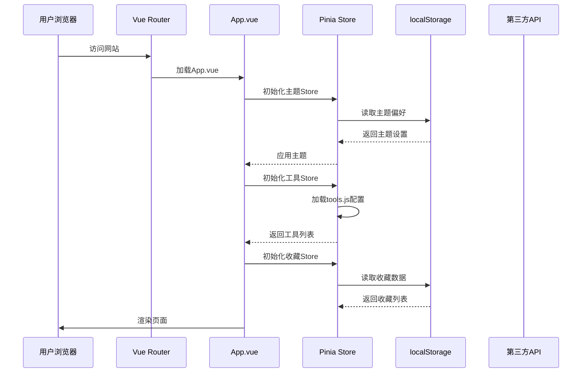
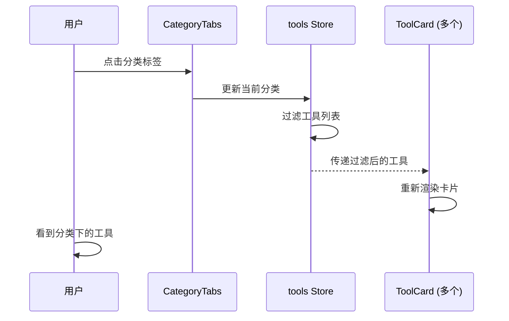
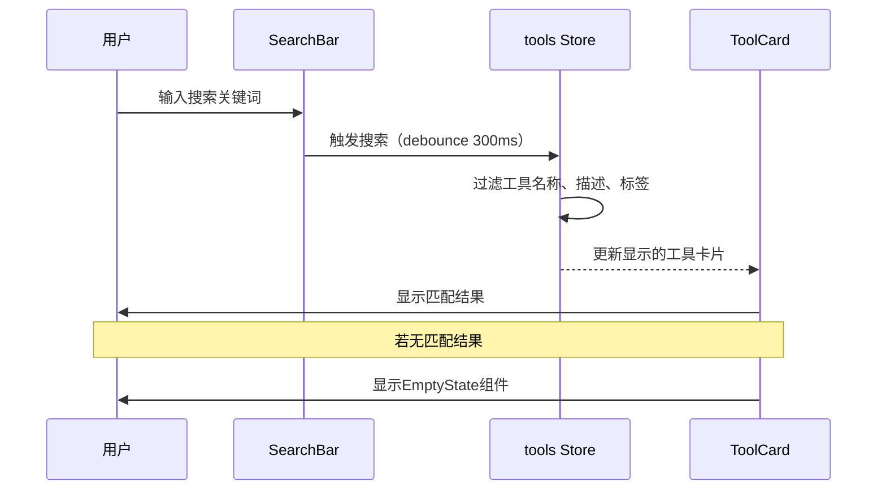
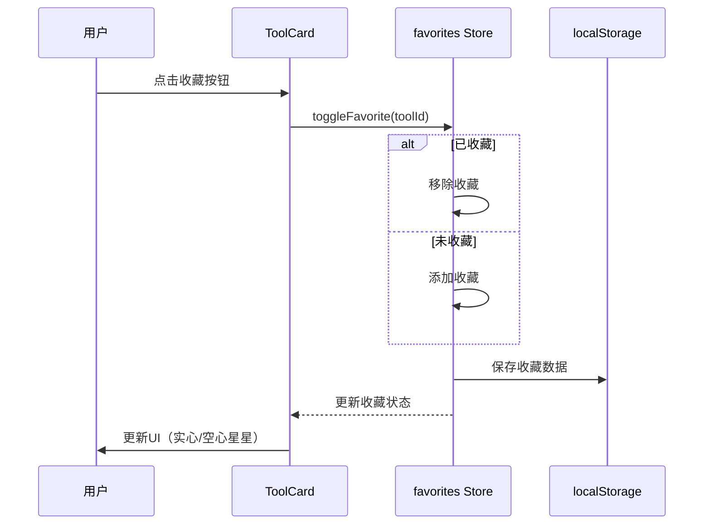
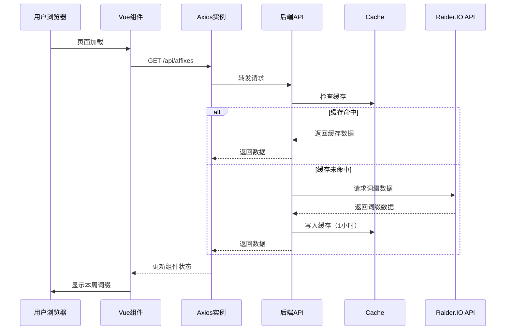

# 魔兽世界玩家导航站 - 系统架构设计文档

## 文档信息

| 字段 | 值 |
|------|-----|
| 文档版本 | v1.0 |
| 编写人 | 高见远（架构师） |
| 日期 | 2026-05-07 |
| 审核状态 | 待审核 |
| 对应PRD | /docs/PRD.md |

---

## 一、实现方案 + 框架选型

### 1.1 前端技术栈详细选型

#### 核心框架
| 技术 | 选型 | 版本 | 理由 |
|------|------|------|------|
| 构建工具 | Vite | ^5.0 | 极速HMR、按需编译、现代化构建 |
| 框架 | Vue 3 | ^3.4 | Composition API、更好的TypeScript支持 |
| UI组件库 | Element Plus | ^2.5 | 中文支持好、组件丰富、文档完善 |
| 状态管理 | Pinia | ^2.1 | Vue 3官方推荐、TypeScript友好、模块化 |
| 路由 | Vue Router | ^4.3 | Vue 3官方路由、懒加载支持 |
| HTTP客户端 | Axios | ^1.6 | 拦截器、取消请求、广泛使用的标准方案 |
| 样式方案 | Tailwind CSS + SCSS | ^3.4 | 原子化CSS快速开发 + SCSS处理复杂样式 |

#### 辅助工具
| 工具 | 用途 |
|------|------|
| dayjs | 日期处理（替代moment.js，体积更小） |
| marked | Markdown渲染（用于蓝帖内容） |
| idb | IndexedDB封装（用于大量本地数据缓存） |

### 1.2 后端技术栈选型

#### 方案决策：**混合架构**

**阶段一（MVP - P0）**：纯前端 + 第三方API
- 无需后端服务器
- 使用公共CORS代理或JSONP解决跨域
- 数据存储在localStorage

**阶段二（P1/P2）**：前端 + Node.js后端
- 后端提供API代理、数据聚合、缓存
- 定时任务获取词缀、蓝帖等数据

#### 后端技术栈（阶段二）
| 技术 | 选型 | 版本 | 理由 |
|------|------|------|------|
| 运行时 | Node.js | ^20 LTS | 长期支持版、性能稳定 |
| 框架 | Express | ^4.18 | 轻量、简单、生态丰富 |
| 缓存 | node-cache | ^5.1 | 内存缓存（替代Redis，降低运维成本） |
| 定时任务 | node-cron | ^3.0 | Cron格式的定时任务 |
| HTTP客户端 | axios | ^1.6 | 调用第三方API |
| CORS | cors | ^2.8 | 跨域支持 |

#### 后端可选升级（未来）
- Redis：用于分布式缓存
- PM2：进程管理和守护
- Docker：容器化部署

### 1.3 构建和部署方案

#### 前端部署
```
开发环境: localhost:5173 (Vite Dev Server)
测试环境: Vercel Preview Deployment
生产环境: Vercel (推荐) 或 Netlify
```

**选择Vercel的理由**：
- 免费HTTPS
- 自动CI/CD（Git推送即部署）
- 全球CDN加速
- 支持环境变量配置

#### 后端部署（阶段二）
```
开发环境: localhost:3000
生产环境: 阿里云/腾讯云轻量应用服务器 (约￥100/月)
```

**备选方案**：
- Render.com（免费层，适合初期）
- Railway（简单易用，按量付费）

#### CI/CD流程
```
Git Push → GitHub → Vercel自动部署（前端）
                  → 服务器Git Pull + PM2重启（后端）
```

---

## 二、文件列表及相对路径

### 2.1 前端项目结构

```
anhei-games/
├── docs/                          # 文档目录
│   ├── PRD.md                     # 产品需求文档
│   └── ARCHITECTURE.md            # 架构设计文档（本文件）
│
├── frontend/                      # 前端项目根目录
│   ├── index.html                 # 入口HTML
│   ├── package.json               # 依赖配置
│   ├── vite.config.js             # Vite配置
│   ├── tailwind.config.js         # Tailwind配置
│   ├── postcss.config.js          # PostCSS配置
│   ├── .env                       # 环境变量（本地）
│   ├── .env.production            # 生产环境变量
│   │
│   ├── public/                    # 静态资源（直接复制）
│   │   ├── favicon.ico            # 网站图标
│   │   ├── manifest.json          # PWA配置
│   │   ├── robots.txt             # 搜索引擎爬虫配置
│   │   └── images/                # 静态图片
│   │       ├── logo.png
│   │       ├── logo-dark.png
│   │       └── og-image.jpg       # Open Graph图片
│   │
│   └── src/                       # 源代码
│       ├── main.js                # 应用入口
│       ├── App.vue                # 根组件
│       ├── style.css              # 全局样式
│       │
│       ├── api/                   # API调用层
│       │   ├── index.js           # Axios实例配置
│       │   ├── raiderIO.js        # Raider.IO API
│       │   ├── blizzard.js        # Blizzard API（未来）
│       │   └── backend.js         # 后端API（阶段二）
│       │
│       ├── assets/                # 动态资源（需构建处理）
│       │   ├── icons/             # SVG图标
│       │   └── images/            # 图片资源
│       │
│       ├── components/            # 公共组件
│       │   ├── AppHeader.vue      # 顶部导航栏
│       │   ├── AppFooter.vue      # 页脚
│       │   ├── ToolCard.vue       # 工具卡片
│       │   ├── CategoryTabs.vue   # 分类标签栏
│       │   ├── SearchBar.vue      # 搜索栏
│       │   ├── ThemeToggle.vue    # 主题切换按钮
│       │   ├── LoadingSkeleton.vue # 骨架屏
│       │   └── EmptyState.vue     # 空状态提示
│       │
│       ├── composables/           # 组合式函数（Composition API）
│       │   ├── useTheme.js        # 主题管理
│       │   ├── useFavorites.js    # 收藏管理
│       │   ├── useTools.js        # 工具数据管理
│       │   └── useApi.js          # API调用封装
│       │
│       ├── config/                # 配置文件
│       │   ├── categories.js      # 分类配置
│       │   ├── tools.js           # 工具链接数据
│       │   └── constants.js       # 常量定义
│       │
│       ├── layouts/               # 布局组件
│       │   ├── DefaultLayout.vue  # 默认布局
│       │   └── EmptyLayout.vue    # 空白布局（未来扩展）
│       │
│       ├── pages/                 # 页面组件
│       │   ├── HomePage.vue       # 首页
│       │   ├── CategoryPage.vue   # 分类页（复用首页逻辑）
│       │   ├── FavoritesPage.vue  # 收藏页
│       │   └── AboutPage.vue      # 关于页
│       │
│       ├── router/                # 路由配置
│       │   └── index.js           # 路由定义
│       │
│       ├── stores/                # Pinia状态管理
│       │   ├── theme.js           # 主题状态
│       │   ├── favorites.js       # 收藏状态
│       │   └── tools.js           # 工具数据状态
│       │
│       └── utils/                 # 工具函数
│           ├── storage.js         # 本地存储封装
│           ├── helpers.js         # 通用辅助函数
│           └── seo.js             # SEO工具函数
│
├── backend/                       # 后端项目（阶段二）
│   ├── package.json
│   ├── server.js                  # 入口文件
│   ├── .env                       # 环境变量
│   │
│   ├── src/
│   │   ├── routes/                # 路由定义
│   │   │   ├── index.js           # 路由汇总
│   │   │   ├── affixes.js         # 词缀相关
│   │   │   ├── blueposts.js       # 蓝帖相关
│   │   │   └── tools.js           # 工具数据API
│   │   │
│   │   ├── services/              # 业务逻辑
│   │   │   ├── raiderIO.js        # Raider.IO数据获取
│   │   │   ├── blizzard.js        # Blizzard数据获取
│   │   │   ├── nga.js             # NGA数据爬取（未来）
│   │   │   └── bilibili.js        # B站视频数据（未来）
│   │   │
│   │   ├── cache/                 # 缓存管理
│   │   │   └── index.js           # 缓存工具
│   │   │
│   │   ├── cron/                  # 定时任务
│   │   │   └── index.js           # 定时任务定义
│   │   │
│   │   └── utils/                 # 工具函数
│   │       ├── fetchWithCache.js  # 带缓存的获取
│   │       └── errors.js          # 错误处理
│   │
│   └── data/                      # 数据存储（可选）
│       └── .gitkeep
│
└── README.md                      # 项目说明
```

### 2.2 关键文件说明

| 文件路径 | 用途 | 核心职责 |
|----------|------|----------|
| `frontend/src/config/tools.js` | 工具数据 | 所有导航工具的配置数据 |
| `frontend/src/config/categories.js` | 分类配置 | 8大分类的元信息 |
| `frontend/src/components/ToolCard.vue` | 工具卡片 | 展示单个工具的卡片组件 |
| `frontend/src/stores/tools.js` | 工具状态 | 管理工具数据的Pinia Store |
| `frontend/src/composables/useTools.js` | 工具逻辑 | 工具数据的组合式函数 |
| `backend/src/services/raiderIO.js` | API服务 | Raider.IO数据获取逻辑 |

---

## 三、数据结构和接口

### 3.1 核心数据模型

#### 工具卡片（Tool）
```javascript
/**
 * 工具卡片数据模型
 * @typedef {Object} Tool
 * @property {number} id - 唯一标识
 * @property {string} name - 工具名称
 * @property {string} description - 工具描述
 * @property {string} url - 工具链接
 * @property {string} icon - 图标URL或名称
 * @property {string} category - 所属分类ID
 * @property {boolean} featured - 是否展示在首页
 * @property {string[]} tags - 标签数组
 * @property {string} [note] - 可选备注
 */
{
  id: 1,
  name: "Raider.IO",
  description: "大秘境与团本排行榜",
  url: "https://raider.io",
  icon: "raiderio",  // 对应/assets/icons/raiderio.svg
  category: "mythic-plus",
  featured: true,
  tags: ["排行榜", "大秘境", "团本"],
  note: "需科学上网访问"
}
```

#### 分类（Category）
```javascript
/**
 * 分类数据模型
 * @typedef {Object} Category
 * @property {string} id - 分类ID
 * @property {string} name - 分类名称
 * @property {string} icon - 分类图标
 * @property {string} description - 分类描述
 */
{
  id: "common",
  name: "常用工具",
  icon: "tools",
  description: "玩家最常用的工具和网站"
}
```

#### 用户收藏（Favorite）
```javascript
/**
 * 收藏数据模型（存储在localStorage）
 * @typedef {Object} Favorite
 * @property {number} toolId - 工具ID
 * @property {number} addedAt - 添加时间戳
 */
{
  toolId: 1,
  addedAt: 1715068800000
}
```

#### 本周词缀（Affix）
```javascript
/**
 * 词缀数据模型
 * @typedef {Object} Affix
 * @property {string} season - 赛季名称
 * @property {Object[]} affixes - 本周词缀列表
 * @property {string} affixes[].name - 词缀名称
 * @property {string} affixes[].description - 词缀描述
 * @property {string} affixes[].icon - 词缀图标
 * @property {string} weekStartDate - 本周开始日期
 */
{
  season: "迈拉克西巅峰战",
  affixes: [
    { name: "强韧", description: "非BOSS敌人生命值提高...", icon: "fortified" },
    { name: "血池", description: "敌人死亡时产生血池...", icon: "bloody" },
    { name: "无常", description: "玩家属性随机波动...", icon: "volcanic" }
  ],
  weekStartDate: "2026-05-05"
}
```

### 3.2 API接口设计

#### 前端调用接口（阶段一：纯前端）

```javascript
// 前端直接调用第三方API（通过CORS代理）
// 注意：阶段一可能需要CORS代理，如 https://cors-anywhere.herokuapp.com/

// Raider.IO API
GET https://raider.io/api/v1/mythic-plus/affixes?region=cn&locale=zh

// 或使用后端代理（推荐）
GET /api/affixes?region=cn
```

#### 后端提供的API（阶段二）

| 接口 | 方法 | 描述 | 缓存时间 |
|------|------|------|----------|
| `/api/affixes` | GET | 获取本周词缀 | 1小时 |
| `/api/blueposts` | GET | 获取最新蓝帖 | 30分钟 |
| `/api/mythic-plus/leaderboard` | GET | 大秘境排行榜 | 1小时 |
| `/api/tools` | GET | 获取工具列表 | 不缓存（前端管理） |
| `/api/tools/featured` | GET | 获取首页推荐工具 | 不缓存 |

#### 接口响应格式规范

```javascript
// 成功响应
{
  "success": true,
  "data": { ... },
  "message": "操作成功",
  "timestamp": 1715068800000
}

// 错误响应
{
  "success": false,
  "error": {
    "code": "ERR_API_UNAVAILABLE",
    "message": "第三方API暂时不可用，请稍后重试"
  },
  "timestamp": 1715068800000
}
```

### 3.3 第三方API集成方案

#### Raider.IO API
```javascript
// 集成方案
// 文档：https://raider.io/api
// 免费层：有请求限制
// 策略：后端缓存响应，减少API调用

// 主要接口
GET /api/v1/mythic-plus/affixes  // 获取词缀
GET /api/v1/characters/profile   // 获取角色信息
GET /api/v1/leaderboards         // 获取排行榜
```

#### Blizzard API（未来）
```javascript
// 集成方案
// 文档：https://develop.battle.net/
// 需要OAuth 2.0认证
// 策略：后端处理认证，前端无需关心token

// 认证流程
1. 后端使用Client ID + Client Secret获取Access Token
2. 使用Access Token调用Blizzard API
3. Token过期自动刷新
```

#### NGA论坛（爬虫方案）
```javascript
// 无官方API，需要爬虫
// 策略：后端定时爬取热门帖子
// 频率：每30分钟一次
// 反爬：设置合理延迟、使用代理（如有需要）
```

---

## 四、程序调用流程

### 4.1 页面初始加载流程



### 4.2 分类切换流程



### 4.3 搜索流程



### 4.4 收藏功能流程



### 4.5 词缀数据获取流程（阶段二）



---

## 五、任务列表（关键输出）

### 任务分级说明
- **P0**：核心功能，必须完成才能上线
- **P1**：重要功能，提升用户体验
- **P2**：增强功能，差异化竞争

### 阶段一：MVP（P0核心功能）

| 任务ID | 任务名称 | 详细描述 | 依赖任务 | 预估工作量 | 优先级 |
|--------|----------|----------|----------|------------|--------|
| T001 | 项目初始化 | 创建Vue 3 + Vite项目，配置Tailwind CSS、ESLint等 | - | 0.5天 | P0 |
| T002 | 配置路由和布局 | 设置Vue Router，创建DefaultLayout布局组件 | T001 | 0.5天 | P0 |
| T003 | 创建工具数据配置 | 编写config/tools.js，包含8大分类的工具数据 | T001 | 1天 | P0 |
| T004 | 开发ToolCard组件 | 实现工具卡片组件，支持图标、名称、描述展示 | T001 | 0.5天 | P0 |
| T005 | 开发CategoryTabs组件 | 实现分类标签栏，支持点击切换 | T001 | 0.5天 | P0 |
| T006 | 开发HomePage页面 | 整合ToolCard和CategoryTabs，实现首页 | T003,T004,T005 | 1天 | P0 |
| T007 | 开发SearchBar组件 | 实现搜索功能，过滤工具卡片 | T003 | 0.5天 | P0 |
| T008 | 开发AppHeader组件 | 实现顶部导航栏，包含Logo和搜索栏 | T007 | 0.5天 | P0 |
| T009 | 开发AppFooter组件 | 实现页脚，包含免责声明和链接 | T001 | 0.5天 | P0 |
| T010 | 实现响应式布局 | 使用Tailwind CSS实现移动端适配 | T006,T008,T009 | 1天 | P0 |
| T011 | 部署到Vercel | 配置Vercel部署，绑定域名 | T010 | 0.5天 | P0 |

**阶段一总计**：约7-8天

### 阶段二：功能增强（P1重要功能）

| 任务ID | 任务名称 | 详细描述 | 依赖任务 | 预估工作量 | 优先级 |
|--------|----------|----------|----------|------------|--------|
| T012 | 实现主题切换 | 开发useTheme组合式函数，支持亮色/暗色模式 | T001 | 0.5天 | P1 |
| T013 | 开发ThemeToggle组件 | 实现主题切换按钮 | T012 | 0.3天 | P1 |
| T014 | 实现收藏功能 | 开发useFavorites和favorites Store，使用localStorage持久化 | T001 | 0.5天 | P1 |
| T015 | 开发FavoritesPage页面 | 展示用户收藏的工具 | T014 | 0.5天 | P1 |
| T016 | 创建后端项目 | 初始化Node.js + Express项目，配置CORS、缓存等 | T011 | 0.5天 | P1 |
| T017 | 实现词缀API接口 | 后端获取Raider.IO词缀数据，添加缓存 | T016 | 0.5天 | P1 |
| T018 | 开发AffixDisplay组件 | 前端展示本周词缀 | T017 | 0.5天 | P1 |
| T019 | 实现蓝帖API接口 | 后端获取蓝帖数据（爬虫或API） | T016 | 1天 | P1 |
| T020 | 开发BluePost组件 | 前端展示最新蓝帖列表 | T019 | 0.5天 | P1 |
| T021 | 开发角色查询入口 | 实现角色查询表单，跳转到Raider.IO | T001 | 0.3天 | P1 |

**阶段二总计**：约6-7天

### 阶段三：差异化功能（P2增强功能）

| 任务ID | 任务名称 | 详细描述 | 依赖任务 | 预估工作量 | 优先级 |
|--------|----------|----------|----------|------------|--------|
| T022 | 实现排行榜API | 后端获取大秘境排行榜数据 | T016 | 1天 | P2 |
| T023 | 开发Leaderboard组件 | 前端展示排行榜 | T022 | 1天 | P2 |
| T024 | 实现NGA爬虫 | 后端定时爬取NGA热门帖子 | T016 | 1.5天 | P2 |
| T025 | 开发NGANews组件 | 前端展示NGA热议 | T024 | 0.5天 | P2 |
| T026 | 实现B站视频API | 后端获取B站魔兽视频 | T016 | 1天 | P2 |
| T027 | 开发VideoCard组件 | 前端展示视频推荐 | T026 | 0.5天 | P2 |
| T028 | 实现用户自定义工具 | 允许用户添加自定义工具链接 | T014 | 1天 | P2 |
| T029 | 实现PWA支持 | 配置manifest.json，实现离线访问 | T011 | 0.5天 | P2 |
| T030 | SEO优化 | 添加meta标签、sitemap、Open Graph | T011 | 0.5天 | P2 |

**阶段三总计**：约8-9天

### 任务依赖关系图

```
T001(项目初始化)
  ├── T002(路由布局)
  ├── T003(工具数据) ──┬── T005(分类标签)
  │                    └── T007(搜索功能)
  ├── T004(工具卡片) ────── T006(首页)
  ├── T008(顶部导航) ────── T006
  ├── T009(页脚)
  ├── T012(主题切换) ────── T013(主题按钮)
  └── T014(收藏功能) ─┬── T015(收藏页)
                      └── T028(自定义工具)

T011(Vercel部署) ─── T016(后端项目) ─┬── T017(词缀API) ─── T018(词缀展示)
                                     ├── T019(蓝帖API) ─── T020(蓝帖展示)
                                     ├── T022(排行榜API) ── T023(排行榜)
                                     ├── T024(NGA爬虫) ──── T025(NGA热议)
                                     └── T026(B站视频API) ─ T027(视频推荐)
```

---

## 六、依赖包列表

### 6.1 前端依赖（package.json）

#### dependencies（生产依赖）
```json
{
  "dependencies": {
    "vue": "^3.4.0",
    "vue-router": "^4.3.0",
    "pinia": "^2.1.0",
    "element-plus": "^2.5.0",
    "@element-plus/icons-vue": "^2.3.0",
    "axios": "^1.6.0",
    "dayjs": "^1.11.0",
    "marked": "^12.0.0",
    "idb": "^8.0.0"
  }
}
```

#### devDependencies（开发依赖）
```json
{
  "devDependencies": {
    "@vitejs/plugin-vue": "^5.0.0",
    "vite": "^5.0.0",
    "tailwindcss": "^3.4.0",
    "postcss": "^8.4.0",
    "autoprefixer": "^10.4.0",
    "sass": "^1.70.0",
    "@tailwindcss/typography": "^0.5.0",
    "eslint": "^8.56.0",
    "eslint-plugin-vue": "^9.21.0",
    "@vue/eslint-config-prettier": "^9.0.0",
    "prettier": "^3.2.0",
    "vite-plugin-pwa": "^0.17.0",
    "vue-tsc": "^2.0.0",
    "typescript": "^5.3.0"
  }
}
```

### 6.2 后端依赖（package.json）

#### dependencies（生产依赖）
```json
{
  "dependencies": {
    "express": "^4.18.0",
    "cors": "^2.8.5",
    "axios": "^1.6.0",
    "node-cache": "^5.1.0",
    "node-cron": "^3.0.0",
    "dotenv": "^16.4.0",
    "cheerio": "^1.0.0",
    "express-rate-limit": "^7.2.0"
  }
}
```

#### devDependencies（开发依赖）
```json
{
  "devDependencies": {
    "nodemon": "^3.1.0",
    "eslint": "^8.56.0",
    "prettier": "^3.2.0"
  }
}
```

---

## 七、共享知识

### 7.1 跨文件约定

#### 命名规范
```
文件命名：
- Vue组件：PascalCase（如 ToolCard.vue）
- 组合式函数：camelCase，以use开头（如 useTheme.js）
- 配置文件：camelCase（如 categories.js）
- 工具函数：camelCase（如 helpers.js）

变量命名：
- 组件实例：PascalCase
- ref/reactive：camelCase
- 常量：UPPER_SNAKE_CASE
- 私有函数：前缀下划线（如 _fetchData）
```

#### 代码风格
```javascript
// ESLint配置（.eslintrc.js）
module.exports = {
  extends: [
    'plugin:vue/vue3-recommended',
    '@vue/eslint-config-prettier'
  ],
  rules: {
    'vue/multi-word-component-names': 'off',
    'vue/no-unused-components': 'warn'
  }
}

// Prettier配置（.prettierrc）
{
  "semi": true,
  "singleQuote": false,
  "tabWidth": 2,
  "trailingComma": "es5"
}
```

#### 注释规范
```javascript
/**
 * 工具函数：防抖
 * @param {Function} fn - 要防抖的函数
 * @param {number} delay - 延迟时间（毫秒）
 * @returns {Function} 防抖后的函数
 */
export function debounce(fn, delay = 300) {
  let timer = null
  return function (...args) {
    clearTimeout(timer)
    timer = setTimeout(() => fn.apply(this, args), delay)
  }
}
```

### 7.2 组件设计原则

#### 组件分类
1. **展示组件（Presentational）**：只负责UI展示，通过props接收数据
2. **容器组件（Container）**：负责数据获取和状态管理
3. **布局组件（Layout）**：负责页面结构布局

#### 组件通信规范
```
父子组件：props down, events up
跨层级组件：Pinia Store
兄弟组件：共享Store或事件总线（尽量避免）
```

#### 组件结构模板
```vue
<template>
  <!-- 模板内容 -->
</template>

<script setup>
import { ref, computed, onMounted } from 'vue'
import { useXxxStore } from '@/stores/xxx'

// Props定义
const props = defineProps({
  // ...
})

// Emits定义
const emit = defineEmits(['change', 'update'])

// Store使用
const store = useXxxStore()

// 响应式数据
const localState = ref('')

// 计算属性
const computedValue = computed(() => {
  return // ...
})

// 方法
function handleClick() {
  // ...
}

// 生命周期
onMounted(() => {
  // ...
})
</script>

<style scoped lang="scss">
/* 组件样式 */
</style>
```

### 7.3 性能优化策略

#### 前端优化
1. **路由懒加载**：
   ```javascript
   const HomePage = () => import('@/pages/HomePage.vue')
   ```

2. **组件懒加载**：
   ```vue
   <script setup>
   import { defineAsyncComponent } from 'vue'
   const ToolCard = defineAsyncComponent(() => import('@/components/ToolCard.vue'))
   </script>
   ```

3. **虚拟滚动**（未来优化）：
   - 当工具数量超过100时，使用虚拟滚动

4. **图片优化**：
   - 使用WebP格式
   - 实现懒加载
   - 使用CDN加速

5. **API请求优化**：
   - 请求去重
   - 响应缓存
   - 防抖搜索

#### 后端优化（阶段二）
1. **响应缓存**：使用node-cache缓存API响应
2. **请求合并**：合并多个工具的API请求
3. **定时更新**：避免用户请求时实时爬取

### 7.4 API调用规范

#### Axios实例配置
```javascript
// src/api/index.js
import axios from 'axios'

const apiClient = axios.create({
  baseURL: import.meta.env.VITE_API_BASE_URL || '/api',
  timeout: 10000,
  headers: {
    'Content-Type': 'application/json'
  }
})

// 请求拦截器
apiClient.interceptors.request.use(
  (config) => {
    // 可添加认证token等
    return config
  },
  (error) => Promise.reject(error)
)

// 响应拦截器
apiClient.interceptors.response.use(
  (response) => response.data,
  (error) => {
    // 统一错误处理
    console.error('API Error:', error)
    return Promise.reject(error)
  }
)

export default apiClient
```

#### API调用封装
```javascript
// src/composables/useApi.js
import { ref } from 'vue'
import apiClient from '@/api'

export function useApi() {
  const loading = ref(false)
  const error = ref(null)

  async function fetchData(endpoint, options = {}) {
    loading.value = true
    error.value = null
    
    try {
      const data = await apiClient(endpoint, options)
      return data
    } catch (err) {
      error.value = err.message || '请求失败'
      throw err
    } finally {
      loading.value = false
    }
  }

  return {
    loading,
    error,
    fetchData
  }
}
```

---

## 八、待明确事项

### 8.1 需要用户确认的技术决策

| 序号 | 问题 | 选项 | 建议 |
|------|------|------|------|
| Q1 | 是否需要后端？ | A. 纯前端MVP，后期加后端<br>B. 一开始就做全栈 | **建议A**：快速上线，验证需求 |
| Q2 | UI组件库选择 | A. Element Plus<br>B. Ant Design Vue | **建议A**：中文支持更好 |
| Q3 | 部署平台 | A. Vercel（推荐）<br>B. Netlify<br>C. 自有服务器 | **建议A**：免费、易用 |
| Q4 | 域名 | A. 购买新域名<br>B. 使用免费子域名 | 待用户决定 |
| Q5 | 统计分析 | A. 百度统计<br>B. Google Analytics<br>C. 不接入 | **建议A**：国内用户为主 |

### 8.2 需要进一步调研的问题

| 序号 | 问题 | 调研方向 |
|------|------|----------|
| R1 | Raider.IO API的免费层限制 | 查看官方文档，测试API调用限制 |
| R2 | CORS代理方案 | 调研免费CORS代理的可用性 |
| R3 | Blizzard API申请流程 | 了解OAuth认证流程 |
| R4 | NGA爬虫的可行性 | 测试爬取是否被封禁 |
| R5 | 相似网站的技术方案 | 分析wowdayday.com的技术栈 |

### 8.3 风险提示

| 风险 | 影响 | 应对措施 |
|------|------|----------|
| API访问受限 | 高 | 准备备用数据源、实现缓存 |
| 版权投诉 | 高 | 添加免责声明、使用官方API |
| CORS限制 | 中 | 使用CORS代理或早期规划后端 |
| 开发延期 | 中 | 采用敏捷开发、每周review |

---

## 九、附录

### 9.1 技术架构图

```
┌─────────────────────────────────────────────────────────────┐
│                         用户浏览器                          │
│  ┌─────────────────────────────────────────────────────┐    │
│  │                  Vue 3 前端应用                    │    │
│  │  ┌──────────┐  ┌──────────┐  ┌──────────┐        │    │
│  │  │ 组件层   │  │ 状态管理 │  │ 路由层   │        │    │
│  │  └──────────┘  └──────────┘  └──────────┘        │    │
│  │  ┌──────────┐  ┌──────────┐  ┌──────────┐        │    │
│  │  │ API调用  │  │ 工具函数 │  │ 样式层   │        │    │
│  │  └──────────┘  └──────────┘  └──────────┘        │    │
│  └─────────────────────────────────────────────────────┘    │
│                          ↕ HTTP/HTTPS                      │
├─────────────────────────────────────────────────────────────┤
│                      后端API服务（阶段二）                   │
│  ┌──────────┐  ┌──────────┐  ┌──────────┐                │
│  │ 路由层   │  │ 服务层   │  │ 缓存层   │                │
│  └──────────┘  └──────────┘  └──────────┘                │
│                          ↕                                │
│  ┌─────────────────────────────────────────────────────┐    │
│  │              第三方API / 数据源                     │    │
│  │  Raider.IO    Blizzard    NGA    Bilibili          │    │
│  └─────────────────────────────────────────────────────┘    │
└─────────────────────────────────────────────────────────────┘
```

### 9.2 开发环境要求

```
Node.js: >= 20.0.0
npm: >= 10.0.0 (或使用pnpm >= 8.0.0)
Git: >= 2.30.0
浏览器: Chrome/Edge >= 90, Firefox >= 88
```

### 9.3 相关文档链接

- [Vue 3 官方文档](https://cn.vuejs.org/)
- [Vite 官方文档](https://cn.vitejs.dev/)
- [Element Plus 文档](https://element-plus.org/zh-CN/)
- [Pinia 文档](https://pinia.vuejs.org/zh/)
- [Raider.IO API 文档](https://raider.io/api)
- [Tailwind CSS 文档](https://tailwindcss.com/docs)

---

**文档结束**

*本架构设计文档基于PRD v1.0编写，如有变更请同步更新。*
